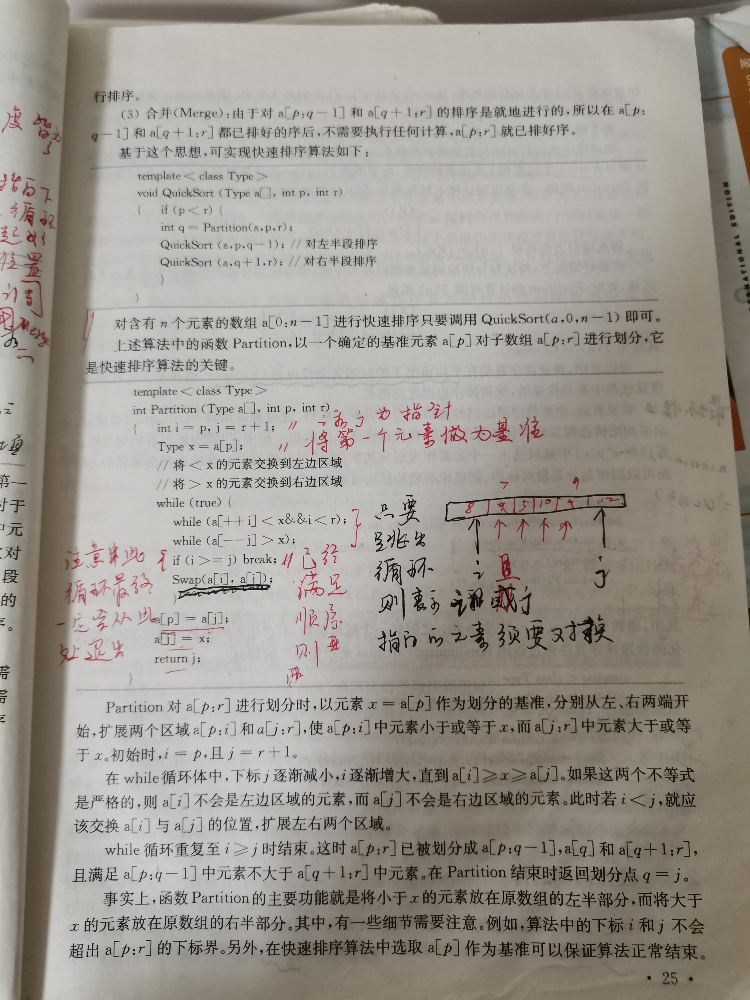

# Quick sort





```c++
#include <algorithm>
/**
* @param start 数组起始下标
* @param end 数组终止下标
**/
template<typename T>
void QuickSort(T a[], int start, int end)
{
	if(start<end)
	{
		int q = Partition(a, start, end);
		QuickSort(a, start, p-1); // 对左半段排序
		QuickSort(a, p+1, end); // 对右半段排序
	}
}
template<typename T>
int Partition(T a[], int start, int end)
{
    int i = start, j = end + 1;
    T x = a[p];
    while(true)
    {
        while(a[++i]<x and i<end);
        while(a[--j]>x);
        if(i>=j)break;
       std::swap(a[i], a[j]); // 使用标准库的swap函数
            
    }
    a[i] = a[j];
    a[j] = x;
    return j;
}
```

